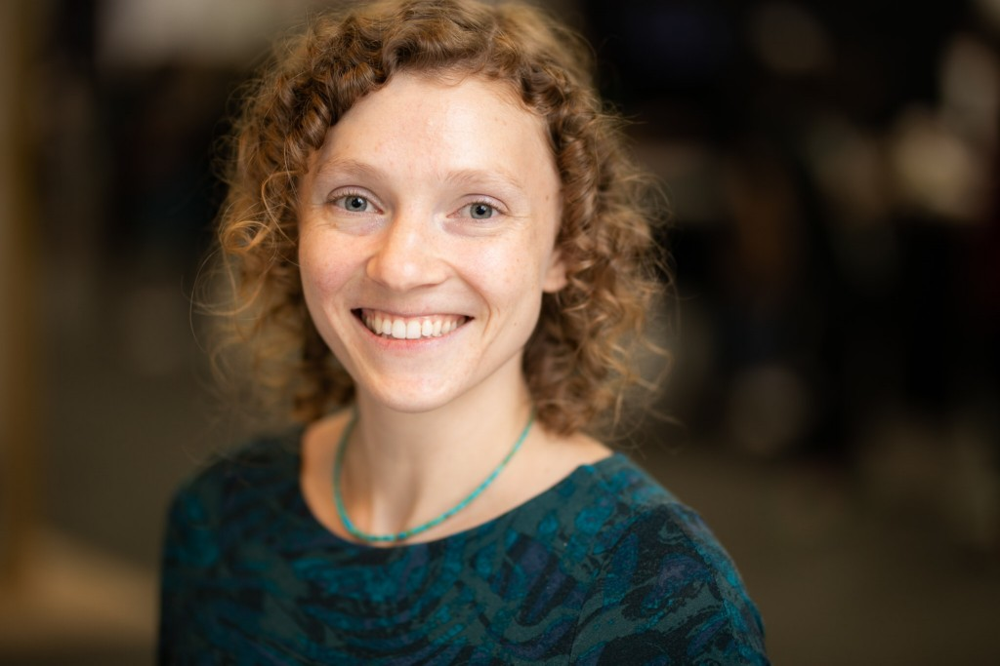

## Lucia Specia: Title to be announced.

**Imperial College London**

<block class="image"></block>

<!---b>Abstract:</b><br-->

<b>Bio:</b> 
Lucia Specia is Professor of Natural Language Processing at Imperial College London, with part-time appointments at the University of Sheffield and Dublin City University. Her research focuses on various aspects of data-driven approaches to language processing, with a particular interest in multimodal and multilingual context models and work at the intersection of language and vision. Her work has been applied to various tasks such as machine translation, image captioning, text adaptation and quality estimation. She is also interested in making machine translation useful for end-users, where tools like quality estimation and automatic post-editing play a big role. She is the recipient of the MultiMT ERC Starting Grant on Multimodal Machine Translation (2016-2021) and is also currently involved in research projects on in-browser machine translation and quality estimation, as well as multilingual referential grounding. In the past she worked as Senior Lecturer at the University of Wolverhampton (2010-2011), and research engineer at the Xerox Research Centre, France (2008-2009, now Naver Labs). She received a PhD in Computer Science from the University of São Paulo, Brazil, in 2008.

## Adina Williams: Title to be announced.

**Imperial College London**

<block class="image"></block>

<!---b>Abstract:</b><br-->

<b>Bio:</b> 
Adina Williams is a Research Scientist at Facebook AI Research in New York City. Her recent projects focus on trying to understand the behavior of deep neural networks from an interdisciplinary perspective that draws from linguistics, cognitive science, and natural language processing. Her current projects focus on combinations of natural language inference, evaluating model performance and explaining model behaviors, dynamic adversarial dataset collection, and information theoretic approaches to computational morphology. Previously, she earned her PhD at New York University in the Department of Linguistics, where she investigated the brain basis of syntactic and semantic processing.
 

