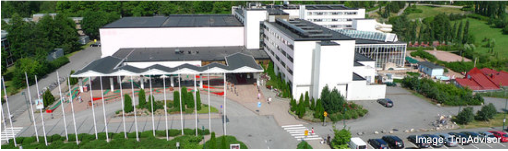
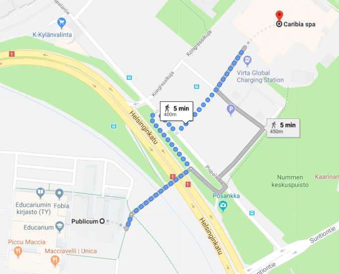

All information about WiFi access, maps, local transport, etc can be found in the <a href="nodalida19_booklet.pdf">conference booklet</a>

## Lunch

The lunch will be served on every day between 12-14 in the Restaurant Terrace in the nearby Hotel Caribia. The hotel is 5 minutes slow walk away and can be seen from in front of the conference venue.

[Location](https://goo.gl/maps/WAtkqcfo8uzEarAS9)

     

     

## Free WIFI networks at the venue

**Eduroam**: If you have previously used the eduroam network in your home institute, you should be able to use the same username and password to connect to all eduroam hotspots at the University of Turku and use the internet. 

**UTU Visitor** In case you do not have an eduroam account, you can use the UTU Visitor network. To begin using the network, choose UTU Visitor from the list of available networks on your device. After you have connected to the network, you will need to open a browser window and you will be redirected to the registration page.

On the registration page, enter your name and an email address (where the login credentials will be sent), and accept the network's terms and conditions. You will be logged in automatically and redirected to the network's guide service.

  * UTU Visitor allows only normal browser traffic, tunneling protocols, and secure email protocols.
  * Your login credentials are active for a fixed period of time. A single user can connect a maximum of two devices to the network.

