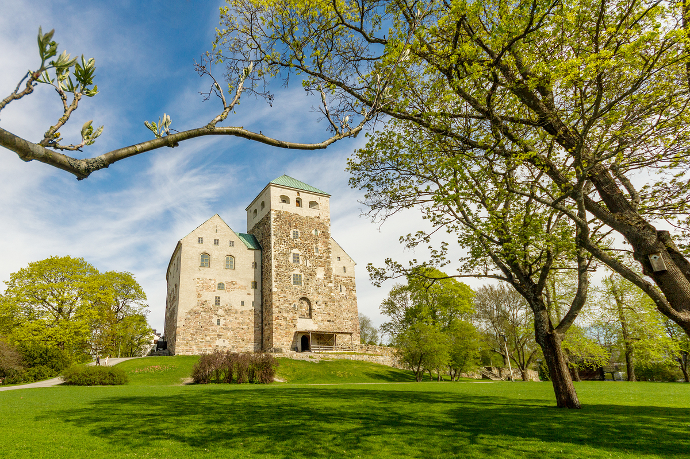

## Welcome reception

     Image: Wikipedia
     

The welcome reception is sponsored by the city of Turku

* Monday 30.9.2019, 19.00-20.30
* Old Town Hall, Aurakatu 2, Turku
* In the city centre, 20-30 min walk from the conference, 2km
* Snacks and a drink

## Conference dinner

     Image: Visit Turku / Museokeskus

The conference dinner will be held in the Turku Castle

* Tuesday 1.10.2019, starting at 19.30, ending at 23.00
* Turku Castle, King's Hall, Linnankatu 80
* By the harbour, 30-45 min (3km) walk from the city centre, following the Aura river
* Full dinner and drinks
* Transport there: bus number 1 direction "satama" (harbour) from the city centre, walk, rental city bikes, and rental kickbikes are other transport options. 
* Transport back: the above options, plus we will have several busses leaving the venue at 23.10 stopping in the centre and by the Caribia hotel.

Bus number 1 timetable:

* There: Direction "Satama" (harbour). Every seven minutes, ride takes 15 minutes from the centre.
* Back: Direction either "Keskusta" (centre) or "Lentoasema" (airport)
  * 20:00 20:07 20:15 20:22 20:30 20:37 20:45 20:52
  * 21:00 21:15 21:30 21:45
  * 22:00 22:20 22:50
  * 23:20

